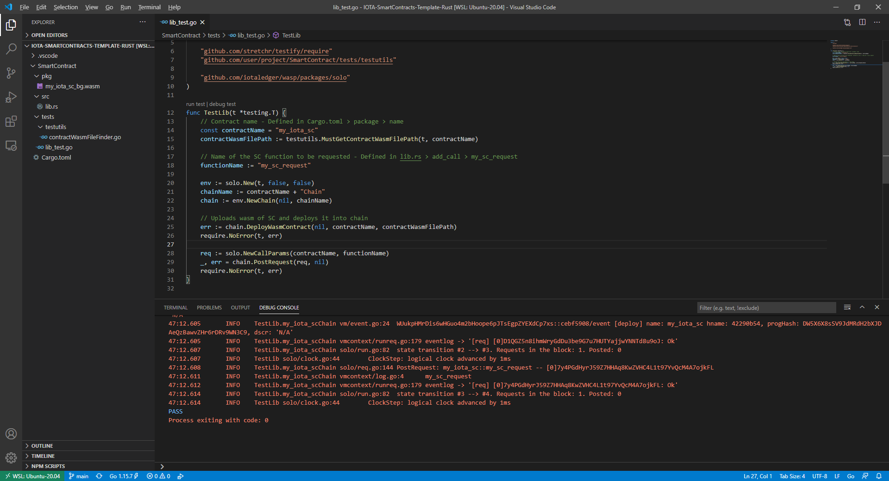

## IOTA smart contracts - Template for development in Rust

A simple template used to start developing your own smart contracts for ISCP (IOTA Smart Contract Protocol) in Rust and write unit tests in Go. 

### Requirements
- [Rust](https://www.rust-lang.org/tools/install)
- [Wasm-pack](https://rustwasm.github.io/wasm-pack/installer/)
- [Go](https://golang.org/dl/)
- Gcc (or equivalent for Windows [(TDM-GCC)](https://jmeubank.github.io/tdm-gcc/))
- [Visual Studio Code](https://code.visualstudio.com/Download) (VSCode)
  - [Rust extension](https://marketplace.visualstudio.com/items?itemName=rust-lang.rust)
  - [Better TOML](https://marketplace.visualstudio.com/items?itemName=bungcip.better-toml) *Optional nice to have 
  - [Go Extension](https://marketplace.visualstudio.com/items?itemName=golang.Go)

#### Why is Go required?
Go is used by [Solo](https://github.com/iotaledger/wasp/tree/develop/packages/solo) to simulate the behavior of Wasp nodes. Unit tests for smart contracts are written in Go so Solo is acessible. The only other option would be to deploy the SCs under development to Wasp nodes, without the chance to test it locally.

#### Simple structure prepared to start with development right away
This is how the templated file structure looks like:

